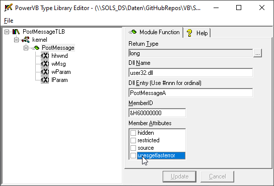

# Sound_MMTimer
## Use MMTimer in your exe, with PostMessage in tlb  
in Matthew Curlands "Type Library Editor" if you put a API function
the Member-Attribute "usesgetlasterror" ist off by default.

